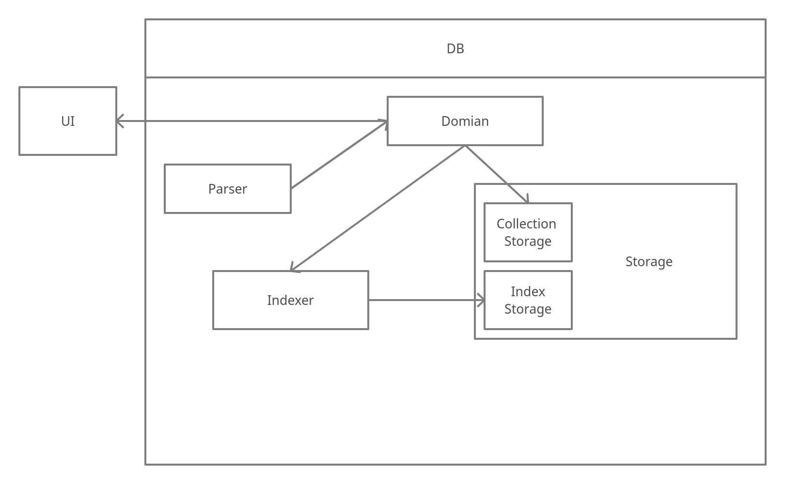

# DDDB

### Variant

Variant №8 - **Collection of text documents with full-text search**

Documents database with inverted index.

## Team
1. Denis Ruban FI-91
2. Ivan Zhytkevych FI-91

## Schedule

| Era        | TBD | Deadline | Complexity |
| -------    | ------------ | -------- | ---------- |
| Stagnation | Writing Storage, Indexer and Domain. | 04.10.2021 | `***` |
| AllDone, Johny | Writing Parser and UI. Linking components. | 01.11.2021 | `*` |
| `O(n!)`   | Evaluating algorithms complexity. Optimizing stage. | 29.11.2021 | `***` |

## Architecture

